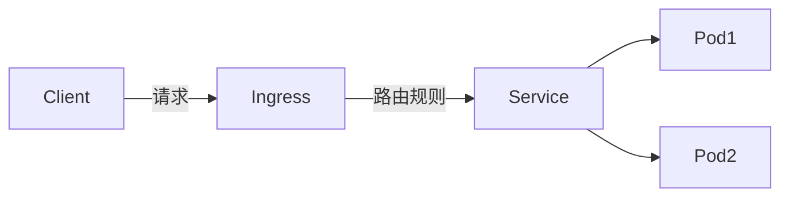

更多个人笔记见[github个人笔记仓库](https://github.com/ZHLOVEYY/IT_note)
个人学习，学习过程中还会不断补充～ （后续会更新在github上）
案例代码仓库：[k8s学习代码](https://github.com/ZHLOVEYY/k8s_learning_code)
每一步重要的我都commit了，可以通过可视化软件比如github desktop 查看

## 简述
接下来通过案例速通k8s
概念部分和前面不需要使用代码，后面主要使用GO（goland）讲解，用别的语言的话结合ai就行，主要就是端口和服务部署的概念，主体程序是什么语言，什么模版换汤不换药

## k8s知识概念
简述：k8s全称kubernetes，用于管理docker[官网](https://kubernetes.io/docs/concepts/)
比如学生是容器，那么老师就是 K8s

### 基础了解
- Pod：实例，比如有一个 Web 应用，部署了三个实例，就是三个pod
- Service：逻辑上的服务，可以认为这个是业务上 XXX 服务的直接映射。
- Deployment：用于管理 Pod 。比如增加pod，减少pod


### 文件概念上理解
重点是留个概念先，关键在实战例子
#### deployment
deployment中apiVersion​​是资源定义（如YAML配置文件）中的关键字段，用于指定该资源所属的​​API组和版本​​。它的作用是确保Kubernetes能够正确解析和处理资源对象的配置，同时支持API的版本迭代和功能扩
#### service
- Deployment 你是没办法从外面访问的，用于将pod封装为逻辑上的服务，解决Pod的动态性问题​​，为应用提供稳定的网络访问入口和负载均衡。
（golang可以文件夹右键生成k8s resource 方便）

- 理解port，Node port（如果不采用LoadBalancer负载均衡的话），target port 
	port是集群内部服务访问的端口
	targetport是外部访问的端口～
	如果没有设置targetport而是负载均衡的LoadBalancer设置，那么port也会作为外部可以访问的端口
这个结合后面的实例理解

#### pv和pvc
- 储存空间被抽象为 PersistentVolume（持久化卷）PVC多个“claim”，一个容器需要什么存储资源，是通过PersistentVolumeClaim 来声明的

- 绑定流程：
	1. 管理员创建PV（或通过`StorageClass`动态生成）。
	2. 用户创建PVC，声明存储需求（如10Gi的`ReadWriteOnce`存储）。
	3. K8s自动将PVC绑定到符合条件的PV
PV的生命周期独立于Pod，即使Pod删除，PV中的数据仍保留。
举个例子：你现在和对象一起去旅游，对象负责组织。那么PersistentVolumeClaim 就是你跟你对象说，我要去什么样的景点。而 PersistentVolume 就是卖票网站上说还有什么票可以买。

- volumeMounts，意思是挂载到我容器的哪个地方。
- volumns 是指，我这里挂载的东西究竟是什么。
- AccessMode 是说明我这个 PV 支持什么访问模式
	- ReadWriteOnce：只能被挂在到一个 Pod，被它读写。
	- ReadOnlyMany：可以被多个 Pod 挂载，但是只能读。
	- ReadWriteMany：可以被多个 Pod 挂载，它们都能读写。

#### ingress
- ingress 概念涉及到k8s部署nginx，Ingress 代表路由规则。你前端发过来的各种请求，在经过 Ingress 之后会转发到特定的 Service 上，再到pod
- Ingress controller 可以控制住整个集群内部的所有 Ingress,相当于ingress是配置而controller用于执行这些配置

ingress需要自己配置localhost的站点信息



## 案例速通
主要是了解k8s常见的配置文件等怎么书写
[官方书写配置文档]([k8s官方书写deployment文档](https://kubernetes.io/docs/concepts/workloads/controllers/deployment/)) 可以参考，不过听说写的不太好

### 安装部署

#### 配置终端代理
老生常谈了，见[终端魔法代理（速通）](https://blog.csdn.net/Carlos5en/article/details/147233730)
或者知道这个概念也是很好的
（curl指令中也有-x指定端口的用法）
#### 安装k8s
（仅提供mac）  安装docker 软件，在设置中就能找到k8s，直接打开开启 Enable Kubernetes使用就行，第一次使用会下载一阵子，记得用魔法。
win听说最好是专业版的不然后面可能使用会有问题什么的（可以留个debug思路）

#### 安装kubectl
用于执行命令管理k8s的工具 [官网下载](https://kubernetes.io/docs/tasks/tools/)找到对应型号指令执行就行，比如我是 macos + apple
silcon

检查版本 ：`kubectl version --client` 后面不常用
验证集群连接： `kubectl cluster-info` 后面不常用
检查配置文件：`kubectl config view` 后面不常用
查看节点状态：`kubectl get nodes`    我没咋用

还有一条思路是用rancher，不过不用优先考虑，了解就行

### 主体部署初体验
代码主要看代码仓库[]()，这里不复制粘贴了，主要讲思路
代码仓库中有详细注释，
目标：通过基本web服务器代码体验打包镜像，部署deployment和service的过程

go初始化然后main中gin框架写一个路由，
makefile中打包镜像
终端执行：`make docker`   打包/更新镜像 （将会自动执行dockerfile中的代码，打包）
basic-deployment.yaml
basic-service.yaml

然后执行

``` bash
kubectl apply -f basic-deployment.yaml
kubectl apply -f basic-service.yaml

kubectl get deployments  # 查看状态
kubectl get service  #后面的pod，namespace等指令同理
kubectl delete deployment name
kubectl delete service name


```
（后续会更新在github上）

接着通过postman 或者浏览器，访问设置的82端口  localhost:82/hello 就可以看到hello world
原本是通过8080端口访问的，同时现在也不用执行程序了，直接在容器中
### 部署redis
目标：通过部署redis了解基本应用镜像管理

### 部署mysql 
目标：通过部署sql了解对应部署方式和细节

### 通过pv，pvc将mysql持久化存储
目标：通过pv，pvc将mysql持久化存储，做到能够保存数据

### 部署nginx了解ingress
目标：通过部署nginx了解ingress是怎么分配管理访问流量的


（后续会更新在github上）


